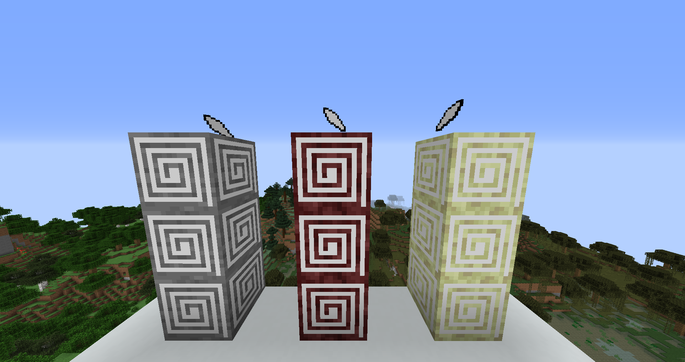
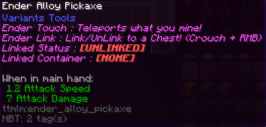
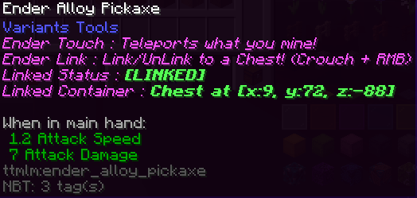
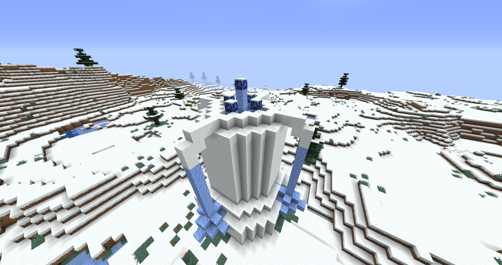
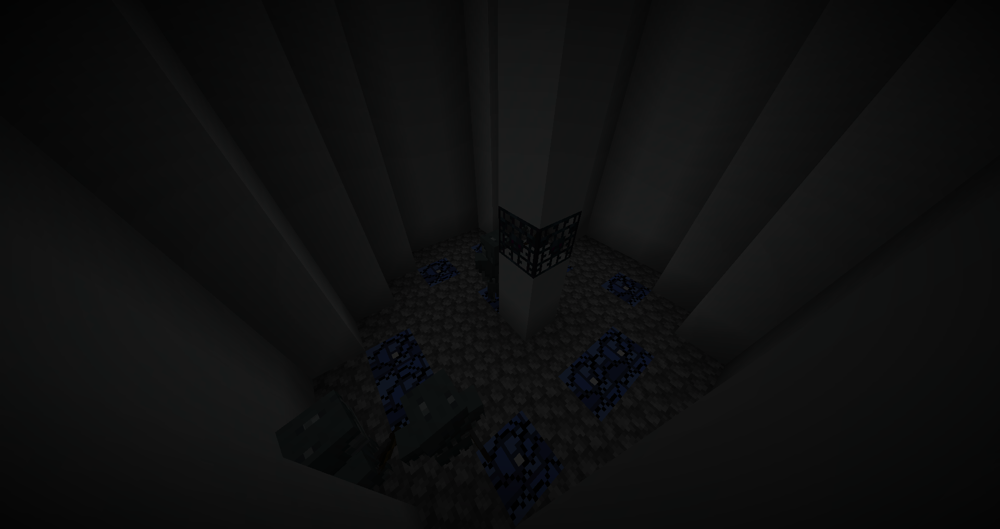
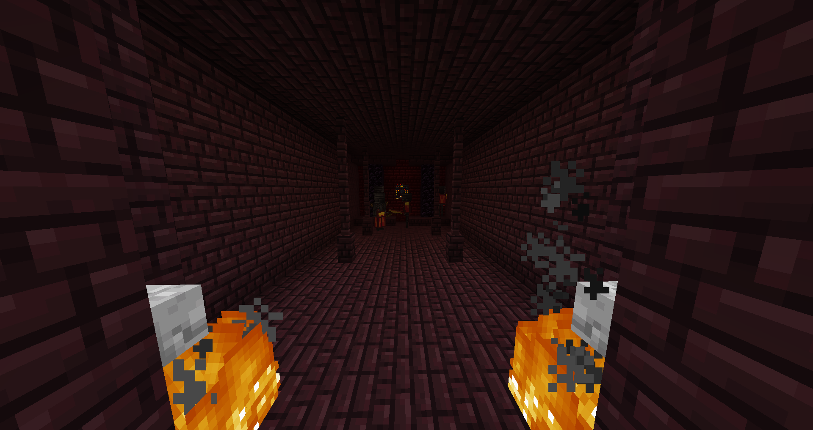
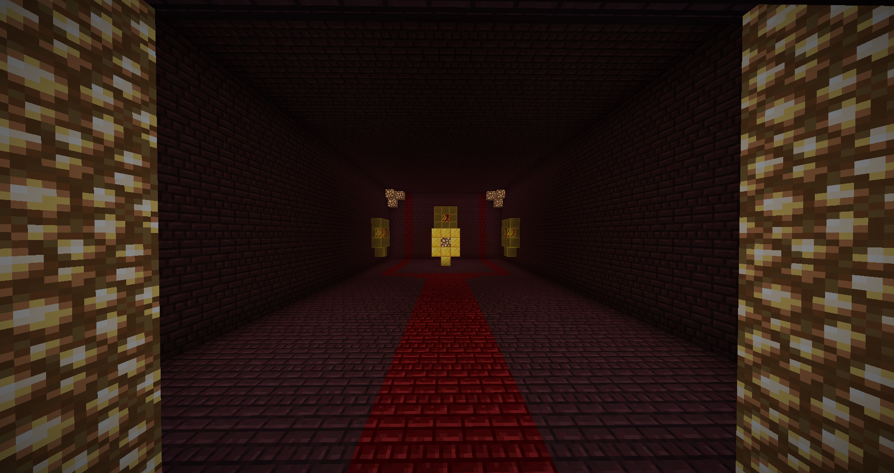

# TTMLM EXPANTION
A simple expansion that adds one new boss, harder mobs, and new materials all while not straying too far from the vanilla gameplay.

### Features
* <h4>3 new ore types<h4>
* <h4>10 new material types(tools, swords, armor, ect...)<h4>

     
   * Mutable Alloy acts as the base
     
   * Each with their own unique attributes
   * For example Link/Unlink
     
     
  

* <h4>Increased the difficulty and changed AI on mobs<h4>

  * New behavior added to skeleton
  * New leader zombies
  * Tunneling endermen
  * Unflinching creepers
  * and more!

* <h4>2 new structures<h4>

  * Snow Dungeon
    
    
  * Hard Fortress
    

* <h4>A New Boss<h4>
    

* <h4>More to come<h4>

